# Blockchain Indexer


## Problem
Blockchain data is optimized for serialized writes, one block at a time, as the chain is being created. Querying the blockchain for data about a specific block or account is fairly straightforward or a "narrow" query. However, querying data across many blocks can be cumbersome because we have to aggregate results from multiple single-block queries. Therefore, we can consider these "wide" queries.  An example of a wide query would be summing the total volume of transactions generated from 2020 to 2022. 

> **Block**:
> A block records some or all of the most recent transactions that have not yet entered any prior blocks. Thus, a block is like a page of a ledger or record book. Each time a block is created, it gives way to the next block in the blockchain. A block is uniquely identified by its hash, and will have a reference to its predecessor's hash. 
## Goal
Enter the blockchain _Indexer_, whose sole objective is to make querying blockchain data fast and easy. For this project, an indexer is implemented to index the ~200 block data provided in `test/resources/200.json`. The indexer will enable one to make "wide" and efficient query within the millisecond range.

## Approach
To enable this, stream of block data will be process, indexed and written to a permanent database for later data analysis using a convenient database query language like SQL. Utilizing an external database instead of indexing the block data in-memory makes the solution more scalable as the size of data grows.

```
blocks[]
├─ block-0/transactions[]
│  ├─ transaction-0
│  │  ├─ [vins]
│  │  │  ├─ vin-0
│  │  │  └─ vin-1
│  │  └─ [vouts]
│  │     ├─ vout-0
│  │     └─ vout-1
│  ├─ transaction-1
│  └─ transaction-2
├─ block-1
├─ block-2
```
Above shows the high-level schema of the block data. Within a network, there are many blocks. Within each block, there are many transactions. Within each transaction, it involves one or more addresses. As the data is largely relational, a sql-based database like PostgreSQL is ideal. Data in our database will be modelled according to the entity relationship diagram (ERD) shown below:

## Implementation
This section aims to capture implementation details at a high-level.
##### Indexes
##### Canonical Chain
> The canonical blockchain is **the main chain that contains blocks and continues to grow in time**.

Each block can potentially point to a next block. However, during the processing interval of that current block, it is unknown if it is part of the main chain. A block can only be part of the main chain, if the next (successor) block also refers the current block as its previous (predecessor) block. 

The indexer processes the block one at a time, and hence it is only at interval i+1 will it be able to update a block at i that it is the main block. Following is a pseudo code:
1. Process current block at height `H` in iteration `i`
2. Insert block_i with `verfied` state set to NULL
3. Update `verified` state of all blocks at height `H-1`  to false. 
4. Get prev block of block_i, block_i-1
5. Update `verified` state of block_i-1  to true.  

Subsequently, when querying block at a particular height H, the following SQL can ensure the resulting block is part of the canonical chain.
```
select block_hash from block_repository where height = H and verified = true
```

##### Indexing on application start up
Following is a sequence diagram of how the blockchain indexing is implemented.

```mermaid
sequenceDiagram
    participant application
    participant blockRepository
    participant blockTxnRepository
    participant addressTxnRepository

    loop over each block
        application-->>blockRepository: Insert new block entity (default 'verified' state NULL)
        Note over blockRepository: Insert block
    alt Block height > 0
        application-->>blockRepository: Update 'verified' state of all blocks at height: h-1 to 'false'
        Note over blockRepository: Update blocks    

        application-->>application: extract prevBlockHash
        application-->>blockRepository: Update 'verified' state of prev block to 'true' (*this block is part of canonical chain)
        Note over blockRepository: Update block    
    end    
        loop over each block's transaction
            application-->>blockTxnRepository: Insert new block-transaction entity
            Note over blockTxnRepository: Insert txn
            
            loop over each transaction.vout.scriptPubKey.address
                application-->>addressTxnRepository: Insert new txn-address entity
                Note over addressTxnRepository: Insert address
            end
        end
    end
```


## Areas of improvement
1. Using columnar database 
> **Columnar database** is a column-oriented storage for database. It is optimized for fast retrieval of data columns, for example for analytical applications. It significantly reduces the overall disk I/O requirements and limits the amount of data you need to load from the disk.
> 
Some examples include Snowflake, Google BigQuery or AWS redshift. These databases allow for extremely fast analytical queries that involves joining of multiple tables and conditions.

1. Separate indexer from API service

Indexer can be a separated into another micro-service that streams, process, index, and persist block data for subsequent analytical query. This reduces the load on the main API service that serves user's wide queries.

## Setting up locally
### Running the application
1. Clone repo
	```
	git clone https://github.com/nsoybean/blockchain-indexer.git
	```

3. We will be using PostgreSQL locally with docker. Hence add `.env` file to root directory. 
Note: Setting `INIT_INDEXER` to true will enable the blockchain indexer to load the JSON test data and store the data in the local PostgreSQL database.
	```
	POSTGRES_USERNAME="postgres"
	POSTGRES_PASSWORD="postgres"
	POSTGRES_DATABASE="postgres"
	POSTGRES_HOST="db"
	POSTGRES_TIMEZONE="Asia/Singapore"
	INIT_INDEXER=true
	```
4. To run the application: 
	```
	docker-compose up
	```
 
Wait for all container to run. Once the logs are seen, head to swagger (`localhost:3000/api`) to play with the APIs 💥
| host:port/path | resource | description |
|  :------------------  |  :------  |  :----  |
| localhost:3000/api | api swagger doc | primitive/ aggregate endpoints can be tested here |
| localhost:8080/ | database management tool | use the credentials configured in your env file |

### Running the test
1. Run only the DB svc
	```
	docker-compose up db
	```
2. Run e2e test
	```
 	// change postgress host to 'localhost' in .env file
 	POSTGRES_HOST="db"

 	// run script
	npm run test
	```
